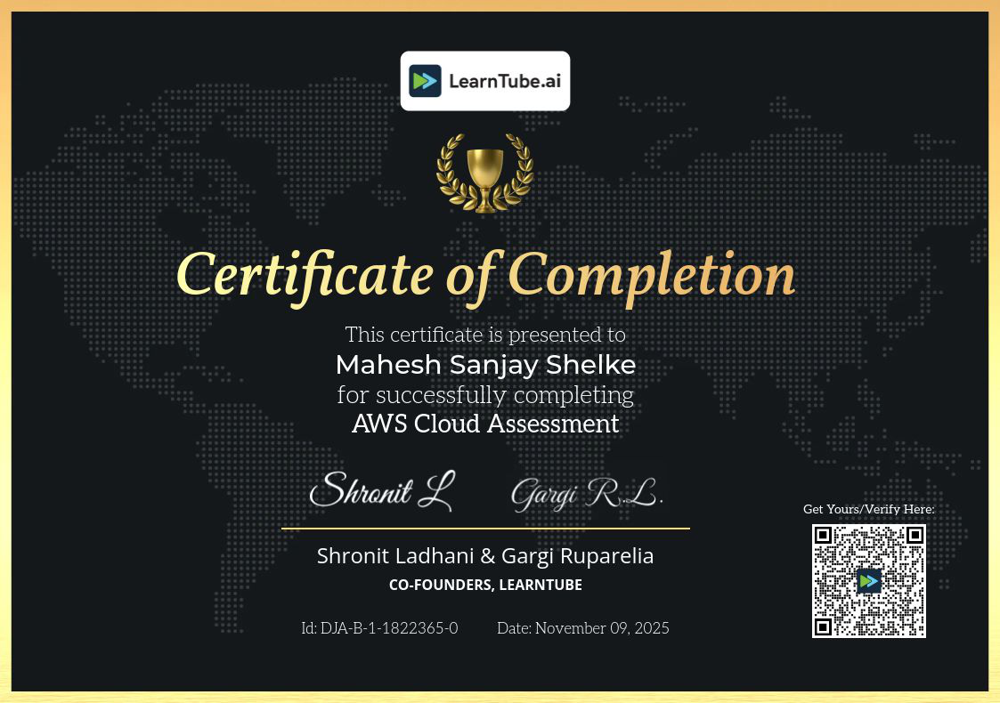

<!-- =========================================================
 🌟 Mahesh Shelke | DevOps & Cloud Practitioner — Ultimate Animated README.md
 🚀 All Projects | Certificates | Professional Design | Skill Highlights
========================================================== -->

<!-- 💫 Animated Typing Header -->

  

<!-- 🌈 Animated Gradient Header -->

  

<!-- 🔥 Glowing Animated Badges -->

  
  
  
  

<h3 align="center">🚀 DevOps & Cloud Practitioner | AWS | Serverless | CI/CD | Python </h3>

---

## 🌟 About Me
Hi 👋 I’m **Mahesh Shelke**, a passionate **DevOps & Cloud Engineer** from 🇮🇳.  
I specialize in **AWS Cloud, CI/CD Pipelines, Serverless, Cloud Automation**, and **Scripting with Python**.  
I love building **automated, scalable, and secure systems** to make development seamless and efficient ⚙️.

> 💬 *“Automation isn’t a task — it’s a lifestyle.”*

---

## 🧠 Skills & Technologies

### ☁️ Cloud & Infrastructure
- Amazon Web Services (EC2, S3, RDS, IAM, VPC, CloudWatch, Lambda, API Gateway, Route53, DynamoDB)
- Serverless Architectures (Lambda, EventBridge, SQS, SNS)
- Infrastructure as Code (Terraform, CloudFormation)

### 🔧 DevOps & Automation
- Jenkins, GitHub Actions, AWS CodePipeline
- CI/CD Pipelines and Deployment Automation
- Docker, PM2, Nginx

### 💻 Programming & Web Development
- Python, Bash, HTML, CSS, JavaScript, PHP
- Flask, Node.js, RESTful APIs

### 🗄️ Databases
- MySQL, DynamoDB, RDS

### 🧩 Tools & Monitoring
- Git, GitHub, Postman, VSCode, Linux, CloudWatch

---

## ⚙️ Domains, Skills & Projects

| 💠 Domain | 🧠 Technologies | 🚀 Projects |
|:----------|:----------------|:-------------|
| ☁️ **AWS Cloud** | EC2, S3, IAM, VPC, CloudWatch, RDS, DynamoDB, SNS, Route53 | 🎬 [Movie Ticket Booking System – AWS 3-Tier](https://github.com/Maheshshelke05/Movie-Ticket-Booking-System-AWS-3-Tier-Architecture-) |
| 🌀 **Serverless Architecture** | Lambda, API Gateway, EventBridge, DynamoDB, SNS, SQS | 🔔 [Amazon Price Tracker](https://github.com/Maheshshelke05/Amazon-Price-Tracker-using-AWS-Services-Serverless) 📺 [YouTube Auto-Uploader](https://github.com/Maheshshelke05/YouTube-Auto-Uploader-Complete-Automated-System-Serverless) ⚙️ [EC2 Management (Lambda + SNS)](https://github.com/Maheshshelke05/EC2-Management-A-Serverless-Solution-with-AWS-Lambda-SNS) |
| 🚀 **CI/CD Automation** | Jenkins, GitHub Actions, CodePipeline, EC2, Docker, PM2 | ⭐ [Student App – Complete CI/CD Pipeline](https://github.com/Maheshshelke05/Student-App-Complete-DevOps-CI-CD-Project-) 🚗 [AutoVision 3D – Node.js + Jenkins + AWS + PM2](https://github.com/Maheshshelke05/-AutoVision-3D-Complete-3D-Car-View-Website-Node.js-Jenkins-AWS-EC2-PM2-) 🔐 [Flask Login/Signup Deployment](https://github.com/Maheshshelke05/Automated-Python-Flask-Login-Signup-Deployment-using-Jenkins-GitHub-AWS-EC2) |
| 🗄️ **Database Management** | MySQL, RDS, DynamoDB | ⚡ [Amazon DynamoDB Hands-on Project](https://github.com/Maheshshelke05/-Amazon-DynamoDB-) |
| 💻 **Programming & Web** | Python, HTML, CSS, JavaScript, PHP | 🎹 [Air Piano – Motion-based Project](https://github.com/Maheshshelke05/Air--piano--) 🤖 [Personal AI Voice Assistant (Jarvis Clone)](https://github.com/Maheshshelke05/Personal-AI-Voice-Assistant) 📱 [Instagram Video Downloader (Python)](https://github.com/Maheshshelke05/Instagram-Video-Downloader-Python) |

---

## 🏅 Certificates

📜 **Certificate Name:** AWS Cloud Assessment  
🏢 **Issued by:** LearnTube.ai  
📅 **Issued on:** November 09, 2025  
🧾 **Certificate ID:** DJA-B-1-1822365-0  
👨‍💼 **Signatories:** Shronit Ladhani & Gargi Ruparelia (Co-founders, LearnTube)

---

## 📊 GitHub Analytics

  
  
  

---

## 🌐 Let's Connect 

  

  
  
  
  
  

---

## 🎯 Visitor Count

  

<h3 align="center">⚙️ “Code. Automate. Deploy. Repeat.” 💥</h3>

<!-- 🌊 Footer -->

  

